# Advanced Use
This chapter covers usage beyond the basic setup.

## 2.1 Nested Sequences

The level sequences in Forever can contain nested sequences along the linked segments.
A nested sequence is a sequence within a sequence. Whenever the algorithm lands on a
nested sequence, it will start executing it and will keep executing it until the sequence is
done. Nested sequences are useful for example in cases where segments are randomized
but there should be a couple of segments which always need to be spawned in a given order.

To create a nested sequence, open the level editor window and right click inside an
existing sequence. Then choose “New Nested Sequence”. A new, empty nested sequence
will appear.

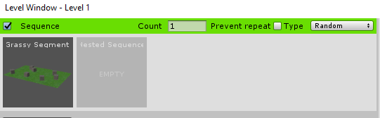

This empty sequence now needs to have segments assigned into it. To do so, right click
on the nested sequence and select “Edit”. This will open up the nested sequence inside the
sequence editor. A sequence path will appear at the top of the editor window which will
point out which sequence is currently being edited.

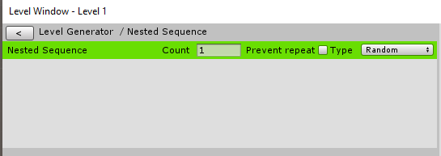

After a sequence is set up, clicking the back button at the top left will return the view
back to the parent sequence. 

There is no limit to how many nested sequences there can be in one another but in most
cases one level of nesting is not required.

## 2.2 The Segment Object Property Component

For extruded segments, each object needs to be configured in the inspector in order to
make sure that it is properly included in the bounds and the right components are bent.
However, when the same prefab object is included in different Level Segments and the same
extrusion rules have to apply to it, having to set up extrusion properties for each instance of
that prefab will be time consuming.

This is why Forever includes the Segment Object Settings component. It is a component
which can be added to any object and will let the user define how the object will be handled
by the extrusion process.

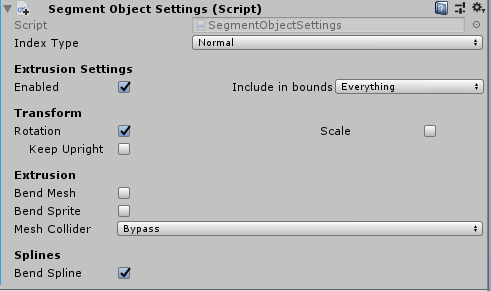

When the Segment Object Settings component is added to an object, it will display the
same UI that the Extrusion Settings window does. These settings will be automatically
assumed by all Level Segments this object gets added to.

When an object with the Segment Object Settings component is opened in the
Extrusion Settings window of a level segment, a message will appear notifying that the
settings from the Segment Object Settings component are being used. This can be
overridden by toggling the “Oberride Settings Component” checkbox:

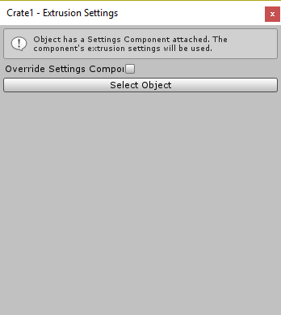

## 2.3 Custom Level Segment Paths

Custom runner paths can be set up for each level segment. The custom paths are user-
defined spline paths that can be used for running along the segment or evaluation. They can
be used by both extruded and custom segments.

To create a custom path, expand the
“Custom Paths” foldout of any given level
segment and click “Add Path”.

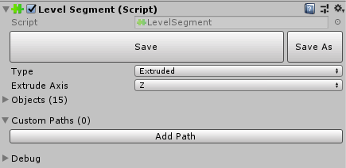

This will automatically create a new
custom path based on the segment type and
extrusion axis. Clicking on the path name will
expand its properties and will enable editing
inside the scene.

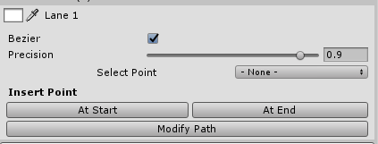

When selected, a path and its points will
be visualized in the scene view. Clicking on
path points inside the scene view will select
them and enable editing for them. Selecting a
point can also be done through the inspector by using the “Select Point” dropdown menu.

The custom paths can either be Bezier or Linear. By default, Bezier is set to true but
disabling it will convert the path into a more simple, linear path.

Adding new points to the custom path is done using the two buttons of the bottom of
the path panel – Insert Point: “At Start” and “At End”. These buttons insert new spline points
after the first and before the last point of the spline.

Removing points is done using the “X” button next to the point selection menu when a
point is selected:

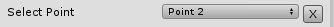

A path cannot have less than two control points so the delete button will not be
available when only two points exist in the path.

### 2.3.1 Editing Custom Path Points

When a custom path point is
selected, its properties will be
exposed in the inspector. The values
of the points are in world
coordinates so it does matter where
the level segment’s transform is
positioned and oriented. However,
editing the values might not be an
efficient way of setting up the
paths. Instead, paths can be edited
directly inside the scene.

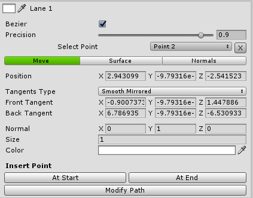

There are three editing tools for the custom paths:

- Move – provides a simple move handle which allows for editing the
    position and the tangents’ positions of each point.

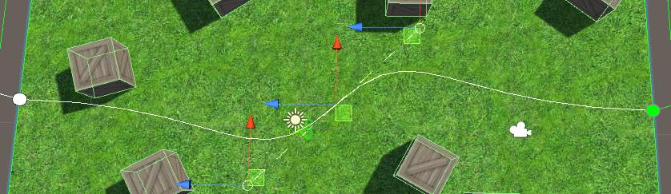

- Surface – It uses raycasting to place the points along the surface of
    colliders. To use it, click and drag the point’s handle over any surface.
- Normals – provides a convenient handle for editing the path normals.

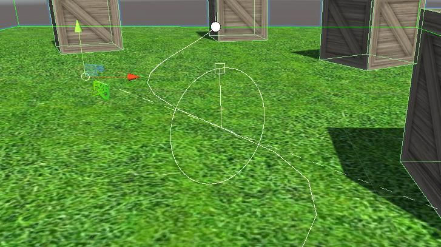

In addition to these
three tools, there are bulk
operations which can be
applied to the paths. They
are found inside the
Modify Path window which
can be accessed through
the “Modify Path” button
in the path inspector.

Currently there are two
operations available –
mass offset and auto
tangents.

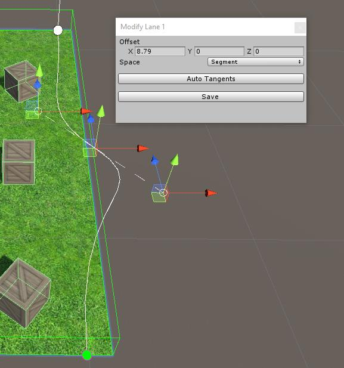

### 2.3.2 Managing the Custom Paths

To manage a custom path, right click on its name for options.

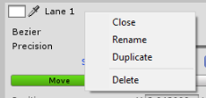

## 2.4 Builders

The Builders are a set of special components which are meant to work in conjunction
with the Level Segment component. These are MonoBehaviours which get called from the
Level Segment upon level generation and can be used to randomize the level segment
layout, spawn a certain game object or further generate procedural geometry.

The Builders do not use the Update, FixedUpdate and LateUpdate methods. Instead,
they have Build and BuildAsync.

When creating builders one of these two methods (or both) has to be overridden in
order to run builder logic.

The Builders have two properties:

- Queue
- Priority


The Queue property defines at which point during the generation will the builder be
executed. **On Generate** will run the builder as soon as the level segment is out and extruded
and **On Activate** will run the builder when the segment gets activated.

Priority defines the order of execution for the builder in the given queue. The higher the
priority value is, the later the builder will be executed. This is useful for situations where
there are builders, dependent on other builders.

This is an example of a builder which has 50% chance of disabling the object it is attached
to.

```csharp
using UnityEngine;
using Dreamteck.Forever;
public class TestBuilder : Builder
{
    protected override void Build()
    {
        base.Build();
        if (Random.Range(0, 100) < 50) gameObject.SetActive(false);
    }
}
```

Forever 1.00 comes with two builders out of the box and more will be added in later
versions.

### 2.4.1 Active Random Children

This Builder will deactivate a random amount of its children upon generation.
The amount of child objects which
will remain active is defined by the
Min Percent and Max Percent
sliders. The percent of active
children after building will be a
value between those two.

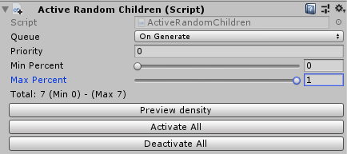

### 2.4.2 Mesh Batcher

The Mesh Batcher Builder does what the name suggests – it looks for meshes
in its children which are using the same material and batches them upon generation.
This is useful for mobile games where draw calls need to be reduced.
In order for it to work, it requires another component to be attached to all
children objects which will be batched – the Batchable. The Mesh Batcher will only
register the Batchable objects in its children, leaving out everything else.

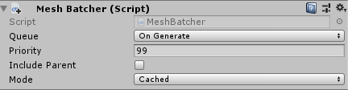

This Builder has two modes:

- Cached – will cache all builders during editing so that it doesn’t have
    to look for them during runtime
- Dynamic – will not cache any builders and will look for them during
    runtime – useful when objects are Instantiated dynamically using
    other builders.

The Mesh Batcher does not include inactive objects in the operation.

## 2.5 Remote Levels

If the game has a lot of levels, each of which using unique resources it might become a
problem at some point. Since a lot of assets will have to be loaded at once, the RAM usage
might increase significantly as well as the load time.

This is why Forever has something called Remote Levels. This is a feature which allows
level information to be exported to different scenes and during runtime, each level will load
its scene in the background when needed. After the level has been played, the level scene
is unloaded once again, freeing up memory.

To create a remote level, create a new scene, delete all objects inside and create a new
empty object at 0,0,0. Then add the Remote Level component to it.

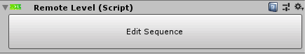

Click “Edit Sequence” and the sequence editor will open. Assign all level segments inside
the sequence editor and deselect the Remote Level object. At this point, the Remote Level
will automatically extract all unique assets from the assigned segments and will spawn them
into the scene. This is required so that Unity can load all assets in the background and
stuttering is evaded when spawning segments for the first time.

The remote level scene must be saved and added to the build queue.

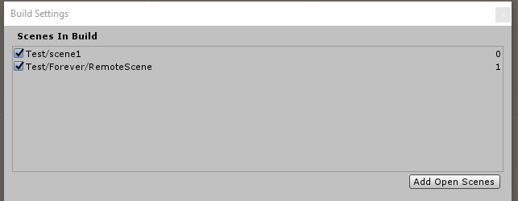

Going back to the main scene with the Level Generator
object, select the Level Generator and open the level which will be
linked to this newly created scene. Inside the level window, toggle
“Remote Scene” – this will make the window much smaller as the
sequence editor will disappear. From the dropdown menu select
the scene, containing the remote level and select a thread priority
for the loading process (usually Below Normal is good).

When the game runs, this level will now load the linked
scene additively as soon as it is needed. When the last segment
from this level is destroyed, the scene will be unloaded in the
background.

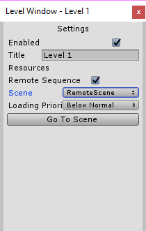

All objects that are created inside the remote scene will be automatically disabled as
soon as the scene loads so there is no need to worry about them showing in up in the game.

## 2.6 Resource Management

Forever cleans up after itself by destroying all generated objects as soon as they are not
used anymore. And with remote level loading, level resources are unloaded per level.
However, there is one other method which can be used to unload unused assets and it is
the Resource Management system.

To use the Resource Management feature, simply add the Resource Management
component to the Level Generator object. No further setup is required – everything will start
working automatically.

The Resource Management system looks for assets that are no longer in use and unloads
them as soon as the last Level Segment that is using them is gone. This feature should be
used with caution because it is only concerned with the resources used in the level
generation itself. If a mesh/material/sound is used in a level segment but it is also used
outside of the level generation loop, upon the destruction of this segment this resource will
be unloaded.

There is a workaround to the Resource
Management unloading unwanted resources
and it is the “Persistent Objects” array. Adding
any objects to this array will make sure that
none of the resources inside get unloaded.

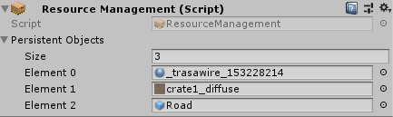

## 2.7 Disabling Multithreading

Multithreading is used to run the calculations for segment extrusion. If for any reason
multithreading is not desired, it can be disabled by adding the **Segment Extruder** component
to the Level Generator object and disabling multithreading in the inspector.

The Segment Extruder component is automatically added during runtime and by default
it is set to use multithreading. If, however Segment Extruder is added in the editor, this
option can be overridden.

## 2.8 Test & Debugging

Forever provides features to help developers test and debug the level generation.

### 2.8.1 Testing New Segments

There is a way to test new level segments without having to create levels and
inserting them into sequences.
To enter test mode, toggle the “Test Mode” checkbox in the Level Generator
inspector. This will enable a game object field for adding a new Level Segment.
Dragging level segments into this field will add them to the test array. When the
game plays, the level generator will only pick random segments from the test array
and will spawn them instead of going through the levels.


Removing segments from that array is done by either clicking the “x” button
or setting their field to None.

Note that only prefabs with the Level Segment component can be added to
the test array.

### 2.8.2 Debugging Level Segments

The Level Segment component provides visual information about its
properties inside the scene view both during edit mode and runtime. The visual
information is only drawn when the segment is selected and can be toggled on or
off.

To define what gets drawn, expand the “Debug” foldout at the bottom of the
Level Segment component’s inspector.

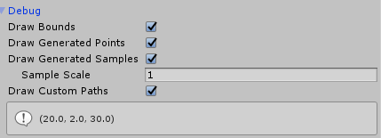

- Draw Bounds – should the segment bounds be drawn when in Extrude
    mode? The bounds size is also displayed at the bottom of the
    inspector.
- Draw Generated Points – should the points from the generated
    segment path be drawn when the segment is selected during
    runtime?

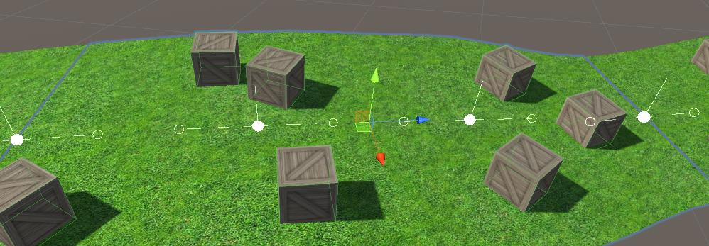

- Draw Generated Samples – should the cached result of the segment’s
    path evaluation be displayed during runtime?

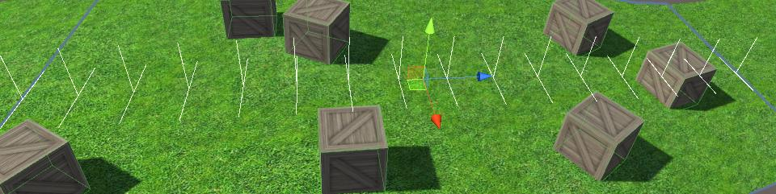

- Sample Scale – multiplier for the size of the cached samples
- Draw Custom Paths – Should the custom segment paths be always
    drawn together?

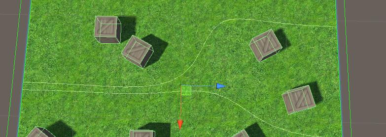

These properties are serialized which means they will be saved with the
segment. Each segment can have its own variation of the debug properties.

