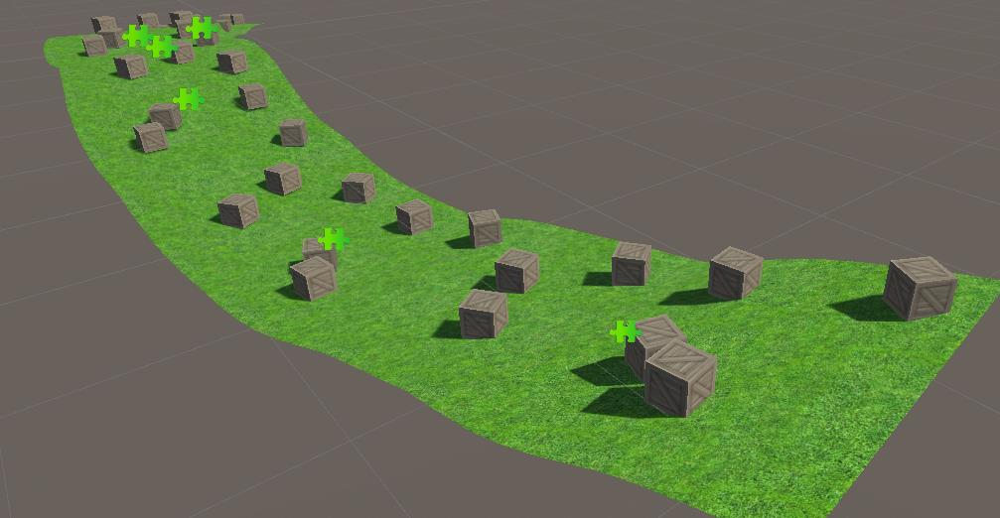
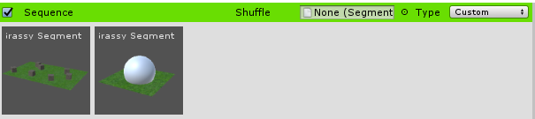

# Extending the Functionality

Forever is designed for flexibility and variety so one of the main goals of the plugin is to have
easily expandable functionality. Expanding the functionality does require C# and OOP knowledge as
it is done via inheritance.

To derive from any of Forever’s classes, the Dreamteck.Forever and namespace needs to be
included first: ```using Dreamteck.Forever;```

## 3.1 Writing Custom Path Generators

Since the paths that are being generated are Bezier splines which also use normals to
define the orientation of the generated geometry, writing a proper robust algorithm for the
generation requires some basic linear algebra knowledge. Fortunately, there are two types
of path generators – the **LevelPathGenerator** and the **HighLevelPathGenerator**. The
LevelPathGenerator class is the base class for all path generators and the
HighLevelPathGenerator is an abstraction for it which reduces some of the hassle of defining
the paths’ points and makes it easier to construct a nice path generating behavior. The
LevelPathGenerator class deals with the spline points themselves and provides the
developer with full control over how spline points are generated.

### 3.1.1 How Path Generators Work?

The path generators have a public method called GeneratePath. This method
is what the Level Generator calls in order to generate paths for each level segment
and it is non-overridable. This is what happens inside this method:

1. The segment for which the path is generated is passed and examined.
    If this segment belongs to a new level, the path generator is notified
    via the OnNewLevel method
2. The segment is checked for custom path rules – these are rules which
    override the work of the path generator – for example, a rule that the
    path for this segment is always flat – without denivelation. (see
    **Custom Path Rules** )
3. A point array for the path is created and is passed to the
    **OnBeforeGeneration** method. This method is by default empty and
    can be used to perform bulk operations on all points prior to the
    actual generation process. It is technically possible to generate the
    entire path in this method.
4. Each point is passed to the **GeneratePoint** method. This method is
    used to define the point’s properties.
5. The point array is passed to one final method – **OnPostGeneration**
    which is used to perform one last bulk operation on the entire point
    array in order to finalize it. This method is also empty by default and
    can also be used to generate the entire path if the other methods are
    not used.
If a Custom Rule is present on the segment, the points will also be passed to
the custom rule’s instances of the same methods – OnBeforeGeneration,


GeneratePoint and OnPostGeneration after the methods are executed inside the
Path Generator.

### 3.1.2. Inheriting the LevelPathGenerator

When inheriting the LevelPathGenerator class, another namespace needs to
be included: ```using Dreamteck.Splines;```

```csharp
using UnityEngine;
using Dreamteck.Forever;
using Dreamteck.Splines;
public class MyPathGenerator : LevelPathGenerator
{
    public override void Initialize(LevelGenerator input)
    {
        base.Restart(input);
        //Any code for initializing the generation process goes here
        //Resetting variables
        //Getting references, etc.
    }
    public override void Continue(LevelPathGenerator previousGenerator)
    {
        base.Continue(previousGenerator);
        //Code for transferring internal data from another generator to this
        one
        //Used during runtime when the LevelGenerator's pathGenerator
        property is assigned
        //This will allow the next generated path to continue from the same
        position and orientation
        //Example: lastPointPosition = ((MyPathGenerator
        )previousGenerator).lastPointPosition;
    }
    protected override void OnNewLevel()
    {
        base.OnNewLevel();
        //Called when a segment from a new level is created
        //Code for increasing difficulty values or resetting goes here
    }
    protected override void OnBeforeGeneration(SplinePoint[] points)
    {
        base.OnBeforeGeneration(points);
        //Bulk operation on all points prior to the actual generation
        //This method is not used in most cases
    }
    protected override void GeneratePoint(ref SplinePoint point, int pointIndex)
    {
        base.GeneratePoint(ref point, pointIndex);
        //Generating a single point
        //point.SetPosition(...);
        //point.SetTangent(...);
        //point.normal = ...;
    }
    protected override void OnPostGeneration(SplinePoint[] points)
    {
        base.OnPostGeneration(points);
        //Finalizing bulk operation on all generated points
        //Example: AutoTangents(ref points, 0);
    }
    protected override void OnOriginOffset(Vector3 direction)
    {
        base.OnOriginOffset(direction);
        //Offset any world Vector3 values that this generator uses by
        "direction"
        //For example, if the latest point's position is cached in a private
        Vector3 field called "lastPosition":
        //lastPosition -= direction;
    }
}
```
LevelPathGenerator-derived classes have access to some protected members
which can come in handy for the path generation.

- **levelGeneratorTransform** – a reference to the Level Generator’s transform from which the path generation starts
- **segment** – the Level Segment the path is being generated for
- **level** – the level of the Level Segment
- **isNewLevel** – is it the first segment of a new level?
- **lastPoint** – a copy of the last generated path point

### 3.1.3 Inheriting the HighLevelPathGenerator

The HighLevelPathGenerator is different than the LevelPathGenerator in a
couple key different ways.

First of all, instead of using the SplinePoint struct, it uses a simpler one called
Point. The Point struct does not have tangents and a normal. Instead it has a rotation
property. However, all points are by default set to automatically generate their
tangents and normals. This is useful because for simpler generation behaviors, all
that is needed is the position of the points to be set.

The HighLevelPathGenerator uses an internal Vector3 property called
orientation. This is the angle of the direction in which the point will be generated.
An orientation of 0,0,0 for each point will produce a straight path. It is not mandatory
to use orientation but it enables the usage of the GetPointPosition method which
uses the orientation in conjunction with the previous point to generate a new
position for the current point.

This is an example of a simple random path generator:

```csharp
using UnityEngine;
using Dreamteck.Forever;
public class MyPathGenerator : HighLevelPathGenerator
{
    protected override void GeneratePoint(ref Point point, int pointIndex)
    {
        base.GeneratePoint(ref point, pointIndex);
        orientation += new Vector3(Random.Range(-10f, 10f), Random.Range(-10f, 10f), 0f);
        point.position = GetPointPosition();
    }
}
```



## 3.2 Writing Custom Builders

Writing a custom builder is simply a matter of inheriting the Builder class and
overriding the Build and/or the BuildAsync methods. Both methods will fire once when
their que comes. Build will execute the entire code immediately while BuildAsync is a
coroutine.

```csharp
using UnityEngine;
using Dreamteck.Forever;
using System.Collections;
public class CustomBuilder : Builder
{
    protected override void Build()
    {
        base.Build();
        //Builder logic
    }
    protected override IEnumerator BuildAsync()
    {
        yield return new WaitForSeconds(1f);
        //delayed logic
    }
}
```

The Reset method can be used to set a default value for the builder’s priority:
```csharp
private void Reset()
{
    priority = 10;
}
```

## 3.3 Segment Shuffle

The Segment Shuffle is a custom rule for picking segments inside a level sequence.
To assign a Segment Shuffle object to a sequence, set its type to custom and then assign
the object in the “Shuffle” field:



To create a Segment Shuffle object, a new class needs to be created and derived from
the SegmentShuffle class. Once a SegmentShuffle class exists, a SegmentShuffle object can
be created by going into Create/Forever/Segment Shuffle.

When inheriting from the SegmentShuffle class, there is only one method that needs to
be overridden – the Get method. In its arguments, it has a reference to the current sequence
along with an index for the current segment. The index is the number of the segment that
is being generated in this run.

There is an internal property called “_isDone” which needs to be set to true when the
shuffle is done so that the sequence can be finalized. If _isDone is not set to true, the
sequence will loop indefinitely.

```csharp
using Dreamteck.Forever;
public class CustomShuffle : SegmentShuffle
{
    public override Level.SegmentDefinition Get(Level.SegmentSequence sequence, int index)
    {
        if (index == sequence.segments.Length - 1) _isDone = true;
        return sequence.segments[(sequence.segments.Length - 1) - index];
    }
}
```

This is an example of a reverse-ordered shuffle which will start from the last segment
and end with the first segment from the sequence definition.

```_isDone``` needs to be set prior to returning the chosen segment.


## 3.4 Custom Path Rules

Custom Path Rules are MonoBehaviours which override the path generation of the
segment they are attached to. They are useful when certain level segments need to have a
specific path that is different from the rest of the segments. Using a Custom Path Rule is
done by **adding it to the root of the Level Segment prefab**.

The logic of the Custom Path Rules is called through the current working Path Generator.
After each OnBeforeGenerate, OnGeneratePoint and OnPostGeneration (see Writing
Custom Path Generators for more information).

In order to create a Custom Path Rule, a new class needs to be created and derived from **CustomPathRule**.

```csharp
using UnityEngine;
using Dreamteck.Forever;
using Dreamteck.Splines;
public class FlatPathRule : CustomPathRule
{
    public override void OnGeneratePoint(SplinePoint point, SplinePoint previous,int pointIndex, int pointCount)
    {
        Vector3 pos = point.position;
        pos.y = previous.position.y;
        point.SetPosition(pos);
        pos = point.tangent;
        pos.y = previous.position.y;
        point.SetTangentPosition(pos);
        point.normal = Vector3.up;
    }
}
```

In this example, the generated points are flattened along the Y axis and the point
normals are set to 0,1,0. The horizontal turns of the path will be preserved but the path will
have no denivelation.

