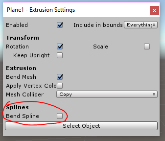
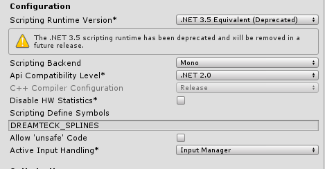

# Forever and Dreamteck Splines

Forever has support for the Dreamteck Splines plugin. Spline objects can be added to the Level
Segments and can be extruded along the level paths.

In order to use Dreamteck Splines with Forever, make sure that the latest version of Dreamteck
Splines is installed in the project. Versions of Dreamteck Splines, older than **1.0.96** will not work and
will create conflicts.

Once Dreamteck Splines is installed, the object property setup for Level Segment objects should
start offering the “Bend Spline” checkbox:



If this is not the case and Dreamteck Splines is confirmed to be installed, then the
“DREAMTECK_SPLINES” scripting define might be missing from the project. To add it, go to
**Edit/Project Settings/Player** and navigate to the **“Scripting Define Symbols”** field:



If the field is not empty, separate the defines with a semicolon:
```MY_CUSTOM_DEFINE;DREAMTECK_SPLINES```